# 🚀 Guide de déploiement Vercel - AlphoGenAI Mini

## 🎯 Architecture Hybride

- **Frontend** : Vercel (Next.js + React)
- **Worker** : Render (Python + Runway)
- **Database** : Supabase (PostgreSQL + Storage)

## 📋 Étapes de configuration Vercel

### 1. Variables d'environnement (OBLIGATOIRES)

Dans le dashboard Vercel → Settings → Environment Variables :

```bash
# Supabase (OBLIGATOIRE)
NEXT_PUBLIC_SUPABASE_URL=https://your-project.supabase.co
NEXT_PUBLIC_SUPABASE_ANON_KEY=eyJhbGciOiJIUzI1NiIsInR5cCI6IkpXVCJ9...
SUPABASE_SERVICE_ROLE_KEY=eyJhbGciOiJIUzI1NiIsInR5cCI6IkpXVCJ9...

# Runway (OPTIONNEL - pour API directe)
RUNWAY_API_URL=https://api.dev.runwayml.com/v1
RUNWAY_API_KEY=your_runway_api_key
```

### 2. Configuration du build

Le projet utilise :
- **Framework** : Next.js 15.5.4
- **Package Manager** : pnpm
- **Build Command** : `pnpm run build`
- **Output Directory** : `.next`

### 3. Fichiers exclus

Le `.vercelignore` exclut :
- Tous les fichiers Python (`workers/`)
- Fichiers de test et documentation
- Fichiers de configuration Render/Railway

## 🔧 Résolution des problèmes

### ❌ Build Error: "Unexpected error"

**Causes possibles :**
1. Variables d'environnement manquantes
2. Conflits avec fichiers Python
3. Dépendances incompatibles

**Solutions :**
1. ✅ Vérifier que `NEXT_PUBLIC_SUPABASE_URL` est définie
2. ✅ S'assurer que `.vercelignore` exclut `workers/`
3. ✅ Vérifier `package.json` et `pnpm-lock.yaml`

### ❌ Runtime Error: Supabase connection

**Solution :**
```bash
# Vérifier les variables
NEXT_PUBLIC_SUPABASE_URL=https://xxx.supabase.co
NEXT_PUBLIC_SUPABASE_ANON_KEY=eyJ...
```

### ❌ API Routes Error

**Solution :**
```bash
# Ajouter la service key
SUPABASE_SERVICE_ROLE_KEY=eyJ...
```

## 🎯 Test de déploiement

### 1. URLs à tester après déploiement

```bash
# Page d'accueil
https://your-app.vercel.app/

# Authentification
https://your-app.vercel.app/auth/login

# Génération (nécessite auth)
https://your-app.vercel.app/creator/generate

# API health check
https://your-app.vercel.app/api/env-check
```

### 2. Fonctionnalités à vérifier

- ✅ **Auth** : Login/signup fonctionne
- ✅ **UI** : Interface s'affiche correctement
- ✅ **API** : Routes API répondent
- ✅ **Jobs** : Création de jobs dans Supabase
- ⏳ **Worker** : Traitement par le worker Render

## 🔄 Workflow complet

```mermaid
graph LR
    A[User sur Vercel] --> B[Soumet prompt]
    B --> C[API Route Vercel]
    C --> D[Crée job Supabase]
    D --> E[Worker Render détecte]
    E --> F[Génère vidéo Runway]
    F --> G[Upload Supabase Storage]
    G --> H[Met à jour job status]
    H --> I[Frontend poll status]
    I --> J[Affiche vidéo]
```



## 🎉 Avantages de cette architecture

- **Performance** : CDN Vercel pour le frontend
- **Scalabilité** : Auto-scaling Vercel
- **Coûts** : Plans gratuits disponibles
- **Simplicité** : Pas de refactoring majeur
- **Fiabilité** : Services spécialisés

## 🚀 Commandes de déploiement

```bash
# Déploiement automatique via Git
git push origin main

# Ou déploiement manuel
vercel --prod
```

---

**Une fois Vercel configuré, le frontend sera accessible mondialement avec des performances optimales !** 🌍